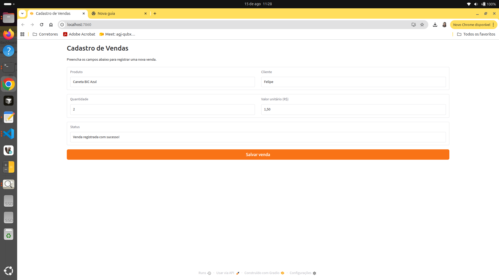

# Cadastro de Vendas — Gradio + Tkinter + Supabase

Atividade Aula 2: evolução do Sistema de Cadastro de Vendas (antes em SQLite local) para um banco
central na nuvem no [Supabase](https://supabase.com), acessado por **duas interfaces
independentes**:

- **Gradio** (web): cadastra novas vendas — somente escrita.
- **Tkinter** (desktop): consulta as vendas já cadastradas — somente leitura.

Ambas conversam com o mesmo banco Postgres gerenciado pelo Supabase, exatamente como
aplicações distintas (site, app, sistema interno) acessam uma fonte de dados única em sistemas
profissionais.

## Arquitetura

Mesma separação em camadas usada no projeto do dashboard de COVID, adaptada para duas views
em vez de uma:

```
config.py                          # le as credenciais do Supabase de variaveis de ambiente
repositories/
  sales_repository.py              # acesso a dados: conecta, le e escreve na tabela vendas
services/
  sales_service.py                 # regras de negocio: validacao do cadastro e consultas
controllers/
  registration_controller.py       # usado SO pelo Gradio - so expoe register()
  query_controller.py              # usado SO pelo Tkinter - so expoe list_all()/search()
cadastro_vendas_app.py             # view (Gradio): formulario de cadastro
consulta_vendas_app.py             # view (Tkinter): tela de consulta
db/schema.sql                      # migration de referencia da tabela vendas
```

- **repository**: só sabe falar com o Supabase. Não conhece Gradio, Tkinter nem regras de negócio.
- **service**: validação (produto obrigatório, quantidade e valor > 0) e consultas. Não sabe quem chamou.
- **controllers**: aqui a separação é o ponto central da atividade — `SalesRegistrationController`
  só expõe `register()` (usado pelo Gradio) e `SalesQueryController` só expõe `list_all()`/`search()`
  (usado pelo Tkinter). Não é só uma convenção: a interface de consulta **não tem, no código, como**
  inserir, editar ou excluir — o método simplesmente não existe naquele controller.
- **views**: `cadastro_vendas_app.py` e `consulta_vendas_app.py` só montam a UI e chamam o
  controller correspondente.

## Pré-requisitos

- Conta no [Supabase](https://supabase.com) (plano gratuito)
- Python 3.11+

## 1. Configurar o Supabase

Veja o passo a passo detalhado em [`SUPABASE_SETUP.md`](SUPABASE_SETUP.md).

Resumo:

1. Criar projeto no Supabase.
2. Rodar [`db/schema.sql`](db/schema.sql) no SQL Editor para criar a tabela `vendas`.
3. Desativar o RLS da tabela (ou criar policies de `select`/`insert` para `anon`).
4. Copiar a URL do projeto e a `anon public key` em Project Settings → API.

## 2. Preparar o ambiente local

```bash
python3 -m venv .venv
source .venv/bin/activate      # Windows: .venv\Scripts\activate
pip install -r requirements.txt
cp .env.example .env            # preencha SUPABASE_URL e SUPABASE_KEY
```

## 3. Rodar as duas interfaces

```bash
python cadastro_vendas_app.py   # abre em http://localhost:7860 - cadastra vendas
python consulta_vendas_app.py   # abre uma janela desktop - consulta vendas
```

Cadastre algumas vendas pelo Gradio e clique em "Atualizar lista" no Tkinter para confirmar que as
duas interfaces enxergam o mesmo banco.

## Entrega

- **Repositório**: https://github.com/JaquelineVictal/cadastro-vendas
- **Banco**: projeto no Supabase, tabela `vendas`, RLS desativado — URL e `anon key` entregues ao
  professor **fora do Git** (ver `CREDENCIAIS_ENTREGA.txt`, gerado localmente e no `.gitignore`).
- **Prints das duas interfaces**: abaixo



_Print da interface Tkinter (consulta) — pendente._

### Texto descritivo

O projeto retoma o Sistema de Cadastro de Vendas feito em Gradio (antes com SQLite local) e o adapta para gravar os dados em um banco Postgres na nuvem, hospedado no Supabase. Foi criada também uma segunda interface, em Python com Tkinter, rodando como aplicativo desktop, que se conecta ao mesmo banco no Supabase — mas apenas para consultar registros já existentes, sem nenhuma função de inserir, editar ou excluir. O código foi organizado em camadas(repository, service e controllers): a interface Tkinter usa um controller que sequer possui um método de escrita, então a restrição de "somente leitura" existe a nível de código, não só de interface. As duas pontas foram testadas de ponta a ponta — uma venda cadastrada pelo Gradio foi confirmada na consulta pelo Tkinter, validando que ambas compartilham o mesmo banco central no Supabase.
